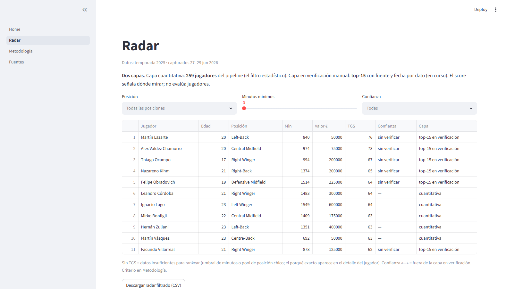

# Potrero Scout ⚽

**Un detector de talento sub-23 infravalorado en la Primera Nacional argentina (segunda división), construido sobre datos públicos y una capa de IA que redacta informes de scouting sin inventar nada.**

Arquitectura replicable a otras ligas del ascenso sudamericano sin reescribir el análisis.

> 🔗 **Demo en vivo:** **https://potrero-scout-sdyte4krc3hjvktx8szswg.streamlit.app**



_La sección Radar (V2): las dos capas señalizadas, Talent Gap Score, nivel de confianza como dimensión separada, filtros de scout y export CSV. Cada TGS se puede desarmar a mano en el detalle del jugador._

---

## La tesis: una asimetría de información

El scouting profesional corre sobre plataformas como Wyscout o Hudl, que cuestan **£20.000+ al año** y concentran su cobertura en las primeras divisiones de Europa. El **ascenso sudamericano** —la Primera Nacional argentina, donde se forma y se revende buena parte del talento joven— es un punto ciego: **no existe ninguna fuente gratuita con datos de eventos ni métricas avanzadas para esta categoría.**

Esa escasez de información *es* la oportunidad. Si nadie mide sistemáticamente al ascenso, hay jugadores que rinden por encima de lo que el mercado todavía ve. Potrero Scout cruza tres señales públicas —**rendimiento ofensivo por-90 alto dentro de su posición + valor de mercado bajo + edad joven**— para producir una shortlist rankeada de candidatos a estar infravalorados, y un informe por jugador que explica el porqué.

No es magia ni promete fichajes seguros. Es un **filtro de productividad ofensiva ajustado por valor y edad: un punto de partida para análisis en video, no un veredicto final.**

---

## El hueco de datos (y cómo lo resolvimos)

El principio que guió el proyecto fue **validar la fuente de datos antes de construir el pipeline**, porque el riesgo número uno era quedarnos sin con qué llenarlo. La validación dio un resultado incómodo pero clarificador:

| Fuente | Resultado real |
|---|---|
| **API-Football** (plan gratis) | Cobertura pobre del ascenso. Descartada. |
| **Sofascore** | **Bloqueada por Cloudflare** (`403 challenge`) incluso vía navegador. No se evadió la protección — se respetó y se descartó. |
| **FBref / StatsBomb** | No cubre la Primera Nacional (solo la Liga Profesional / 1.ª división). |
| **Transfermarkt** (`ARG2`) | ✅ **Única fuente viable** para el ascenso de punta a punta. |

**Cómo lo resolvimos — scrape en dos fases sobre Transfermarkt**, diseñado para controlar el costo:

1. **Fase barata (HTTP, instantánea):** valor de mercado, edad y posición de **toda la liga**, con `cloudscraper` (pasa Cloudflare sin evadir nada).
2. **Fase cara (navegador headless, ~13s/jugador):** goles, asistencias y minutos. Estos datos viven en un componente que carga por JavaScript (XHR), así que hay que **renderizar la página** y parsear la grilla, **aislando la fila de la *Primera Nacional*** específicamente (no el "Total", que sumaría copas). Esta fase corre **solo sobre el subconjunto joven** ya filtrado en la fase barata.

Todo con **rate-limiting** y **caché agresiva en disco**: nada se vuelve a descargar ni a renderizar, y el proceso es **reanudable** si se corta (de hecho, sobrevivió a un corte de luz a mitad de camino).

**Resultado:** dataset limpio de **1.053 jugadores** (36 clubes, temporada 2025), **395 sub-25**, de los cuales **259 tienen estadísticas de rendimiento** utilizables en SQLite.

---

## Cómo funciona

```
Ingesta (2 fases)  →  SQLite limpio  →  Métrica de infravaloración  →  Shortlist  →  Informe IA  →  Dashboard
```

La arquitectura separa **ingesta** de **análisis**: cada fuente es un conector con la misma interfaz. Sumar una liga nueva es agregar/parametrizar un conector, sin tocar la métrica. El esquema-contrato del dataset es mínimo y explícito: `player_id, name, age, position, minutes, market_value_eur, goals_90, assists_90`.

---

## La metodología de la métrica (en lenguaje claro)

Todo el score es una suma de números entre 0 y 1, documentada y auditable a mano. Cero caja negra.

**1. Stats crudas → por-90 minutos.** Goles y asistencias se normalizan por 90' para comparar jugadores con distinto tiempo en cancha.

**2. Por-90 → percentil dentro de la misma posición.** A un jugador se lo compara con sus pares de su *pool* de posición (extremos con extremos, centrales con centrales), no contra toda la liga. Un percentil 0.90 en goles significa "mejor que el 90% de los de su puesto".

**3. Pesos de rendimiento por posición.** El score de rendimiento es un promedio ponderado de los percentiles, y **el peso de cada stat depende del rol** (a un 9 le pesa el gol; a un central, no tanto). Configurable y documentado en un diccionario:

| Familia de posición | Peso goles | Peso asistencias |
|---|---|---|
| Delantero (Centre-Forward) | 0.70 | 0.30 |
| Extremo / volante ofensivo | 0.50 | 0.50 |
| Mediocampo central/defensivo | 0.40 | 0.60 |
| Lateral (Full-Back) | 0.40 | 0.60 |
| Central (Centre-Back) | 0.30 | 0.70 |

**4. Dos guardas anti-ruido, ambas honestas:**
- **Umbral de minutos** (configurable, por defecto 500'): quien no llegó no entra al pool de comparación. Evita que un jugador con 150' y un gol parezca un goleador de elite.
- **Tamaño mínimo de pool** (por defecto 5): si una posición tiene muy pocos jugadores, **no se le inventa un percentil** (un pool de 1 daría un "percentil 1.0" de regalo). Esos jugadores se marcan como *"datos insuficientes para rankear"* y quedan fuera de la shortlist principal. **No rellenar huecos con números fabricados** es la misma filosofía que la capa de IA.

**5. Score de infravaloración** = `0.5 · rendimiento + 0.3 · baratura + 0.2 · juventud + bonus_proyección`, donde *baratura* = qué tan bajo es el valor de mercado respecto a sus pares, *juventud* = qué tan por debajo de los 23 está, y *bonus_proyección* premia a los más jóvenes (heurística de curva de carrera, pico ~26). **Todos los pesos son configurables y están documentados.**

Cada número del ranking se puede desarmar a mano. El dashboard muestra ese desglose por jugador —incluidos los pesos aplicados según su posición— para validarlo con ojo de scout.

---

## La capa de IA y su diseño anti-alucinación

El pipeline **calcula todo lo cuantitativo**; la IA (modelo `claude-opus-4-8`) **solo redacta** sobre números ya calculados. No estima ni inventa. El diseño tiene tres patas:

1. **Structured outputs (`json_schema`):** el informe sale con campos fijos —`perfil`, `fortalezas`, `comparable_estilo`, `tesis_por_que_ahora`, `riesgos`—. Esto garantiza el *formato*; la *veracidad* la cuida el prompt.
2. **System prompt anti-alucinación**, con reglas explícitas:
   - Solo puede citar cifras que estén en los datos provistos.
   - Si un dato no está (no hay percentil, no hay métricas avanzadas), **debe decirlo** en vez de taparlo.
   - El `comparable_estilo` es tentativo y se marca como tal, nunca como hecho.
   - **No puede atribuir mecanismos que el dato no respalda:** puede reportar *cuánto* aporta un jugador (asistencias/90, percentil), pero no *cómo* ni *desde dónde* lo genera ("de pelota parada", "por la banda", "de contraataque") — porque el ascenso no tiene datos de eventos que lo sustenten.
3. **Costo a la vista:** la capa de IA usa la API de Anthropic, paga por uso. Sin `ANTHROPIC_API_KEY` el sistema corre en **dry-run** (muestra qué se le enviaría al modelo, sin llamarlo ni gastar). Un informe son ~centavos.

### Un informe real de ejemplo

Generado sobre **Leonel Cardozo** (central, 22 años, €50.000). Es un buen ejemplo porque **reporta sus propios riesgos con datos reales** en vez de venderlo: cita el percentil de goles flojo *en contra* del jugador, y declara explícitamente lo que no puede saber.

> **PERFIL**
> Leonel Cardozo es un central de 22 años que disputó 660 minutos en la Primera Nacional, con un valor de mercado bajo (€50.000). Es un jugador joven con poca muestra de minutos, lo que obliga a leer sus números con cautela. Su score de rendimiento dentro del pool de centrales es alto (0.805) y aparece como una opción económica e infravalorada (baratura 0.876, score de infravaloración 0.734).
>
> **FORTALEZAS**
> - Aporte ofensivo poco habitual para un central: percentil 0.966 en assists_90 dentro de su posición, con 0.136 asistencias/90. Es su dato más destacado, aunque sobre una muestra chica de 660 minutos.
> - Score de rendimiento alto: 0.805 dentro del pool de centrales.
> - Perfil económico e infravalorado: baratura 0.876 y score de infravaloración 0.734, con valor de mercado de €50.000.
> - Juventud (22 años) con margen de proyección.
>
> **COMPARABLE DE ESTILO** (tentativo)
> Comparación solo orientativa y tentativa: un central joven con cierta vocación de aporte ofensivo en pases que derivan en gol. No hay datos de eventos ni métricas avanzadas para fundamentar un comparable concreto, así que cualquier nombre sería especulativo y no lo afirmo como hecho.
>
> **TESIS — POR QUÉ AHORA**
> La oportunidad pasa por la combinación de bajo costo (€50.000), juventud (22) y un score de rendimiento e infravaloración favorables. El percentil de asistencias es llamativo para un central. La tesis es de apuesta de bajo riesgo económico sobre un perfil joven; conviene actuar antes de que sume más minutos y eventualmente suba su valuación.
>
> **RIESGOS**
> - Muestra muy chica: solo 660 minutos, lo que vuelve inestables todos los indicadores, especialmente el percentil de asistencias.
> - No hay métricas avanzadas para la Primera Nacional (xG, datos de eventos, acciones defensivas): no se puede evaluar su solidez defensiva, que es lo central en un CB.
> - El percentil de goles es medio-bajo (0.431) con 0 goles/90; el aporte ofensivo se apoya casi exclusivamente en asistencias.
> - No hay datos para saber **cómo** genera ese aporte ni para confirmar que sea sostenible en mayor volumen de minutos.

Cada cifra del informe —660', €50.000, rendimiento 0.805, baratura 0.876, infravaloración 0.734, percentil de asistencias 0.966, percentil de goles 0.431— **coincide exactamente con lo que calculó el pipeline.** Y donde el dato no alcanza, el informe lo dice.

---

## Qué mide y qué NO mide (limitaciones honestas)

Un proyecto serio dice lo que **no** puede hacer.

**Qué mide:** productividad ofensiva (goles y asistencias por-90, en percentiles dentro de la posición), relativa al valor de mercado y la edad.

**Qué NO mide:**
- **Nada defensivo.** Sin datos de eventos no hay acciones defensivas, ni duelos, ni posicionamiento. Para un central o un lateral, **la mitad más importante de su juego queda sin medir.** Por eso la herramienta es un filtro ofensivo, no una evaluación integral.
- **Sin métricas avanzadas.** No hay xG, ni progresión de balón, ni calidad de chance. Goles y asistencias son señales útiles pero gruesas.
- **Sin mecanismos.** El dato dice *cuánto* aporta un jugador, no *cómo* — y la herramienta no lo inventa.

**Otras limitaciones:**
- **El valor de mercado es un proxy imperfecto** (estimación de la comunidad de Transfermarkt, no precio real de transferencia).
- **Muestras chicas.** Muchos jóvenes del ascenso juegan pocos minutos; el umbral de 500' ayuda, pero la confiabilidad sigue siendo limitada en varios casos.
- **Zona gris del scraping.** Datos obtenidos por scraping de Transfermarkt con *rate-limiting* agresivo y caché local, para **uso educativo y no comercial**. No se crearon cuentas ni se evadieron protecciones: cuando Sofascore respondió con un desafío de Cloudflare, se respetó y se descartó la fuente.
- **Validación cualitativa pendiente.** El sentido futbolístico de la shortlist necesita el ojo de alguien que conozca el ascenso. La métrica propone; no decide.

---

## Decisiones de diseño

Cada decisión de arquitectura importante está documentada como **ADR** (Architecture Decision Record), con su contexto, las alternativas que se descartaron y sus consecuencias —incluido un postmortem honesto del incidente con la API key.

👉 **[Ver DECISIONS.md](DECISIONS.md)**

---

## Stack

`Python 3` · `pandas` · `SQLite` · `cloudscraper` + navegador headless (vía ScraperFC) para la ingesta · `Streamlit` para el dashboard · **SDK de Anthropic (`claude-opus-4-8`)** con *structured outputs* para los informes.

```
potrero-scout/
├── ingest/        # conector Transfermarkt (2 fases) + caché HTTP/render
├── analysis/      # normalize.py (percentiles) · undervaluation.py (score)
├── reports/       # claude_report.py (capa de IA, anti-alucinación)
├── app/           # streamlit_app.py (dashboard)
├── tests/         # tests de la métrica (pytest)
├── data/          # crudo + dataset limpio (gitignored)
└── db/scout.db    # SQLite (gitignored)
```

---

## Cómo correrlo

```bash
# 1. Entorno
python -m venv .venv
.venv\Scripts\activate            # Windows  (en Linux/Mac: source .venv/bin/activate)
pip install -r requirements.txt

# 2. Claves (opcional: la IA es de pago por uso)
cp .env.example .env              # y completá ANTHROPIC_API_KEY si querés informes reales

# 3. Construir el dataset (scrape Transfermarkt, con caché)
python ingest/build_dataset.py --season 2025

# 4. Ver la métrica / shortlist por consola
python analysis/run_metric.py --min-minutes 500 --top 15 --sub-age 23

# 5. Abrir el dashboard
streamlit run app/streamlit_app.py        # http://localhost:8501

# 6. (Opcional) generar un informe de IA
python reports/claude_report.py --player "Leonel Cardozo"

# Tests
pytest
```

Sin `ANTHROPIC_API_KEY`, la capa de IA corre en **dry-run**: muestra el prompt y los datos que se enviarían, sin llamar a la API ni gastar.

---

## Estado

**V1 funcional, de punta a punta:** ingesta → métrica → shortlist → informe IA → dashboard. Dataset de 259 jugadores con estadísticas, métrica con pesos por posición, capa de IA con diseño anti-alucinación verificado, tests en verde.

**Próximo (V2+):** xG propio sobre eventos, *player similarity* con embeddings, curvas de envejecimiento entrenadas, múltiples ligas en simultáneo, y deploy público en Streamlit Community Cloud.

---

*Proyecto de aprendizaje. Prioriza claridad y honestidad sobre cleverness. Uso educativo / no comercial.*
